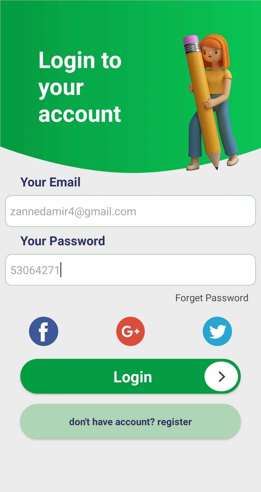

# E-commerce Android Studio Firebase

E-commerce Android template, featuring Firebase, TinyDB, and SharedPreferences integration.

## Images

## Presentation

- [Click here to see the description](projetappli.pdf)

## Demo

- [Click here to see the demo](https://drive.google.com/drive/folders/1-v3LHgxzy9_hhk2FXSfSnJy5nxIxEh2a)

## Notice

- When creating a JSON file in Firebase, maintain the core structure like `test.json`. Additional elements can be added, but stick to the style.

